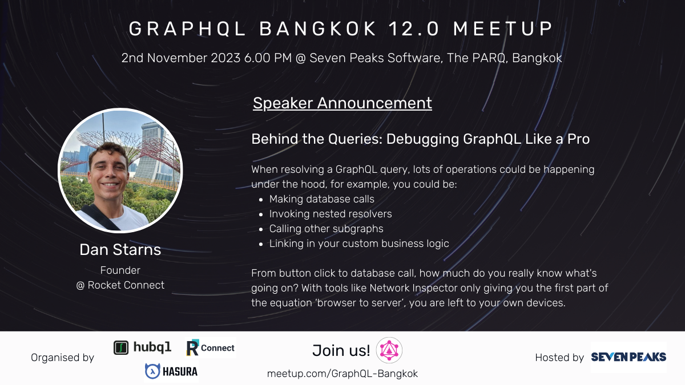

# Behind the Queries: Debugging GraphQL Like a Pro

- https://www.meetup.com/graphql-bangkok/events/296635356/

When resolving a GraphQL query, lots of operations could be happening under the hood, for example, you could be:

- Making database calls
- Invoking nested resolvers
- Calling other subgraphs
- Linking in your custom business logic

From button click to database call, how much do you really know what's going on? With tools like Network Inspector only giving you the first part of the equation ‘browser to server’, you are left to your own devices.



## Getting Started

### Running GraphQL Debugger

```
$ npx graphql-debugger
```

- http://localhost:16686

### Running the server

```
$ npm start
```

- http://localhost:4000/graphql

## License

MIT - Dan Starns
